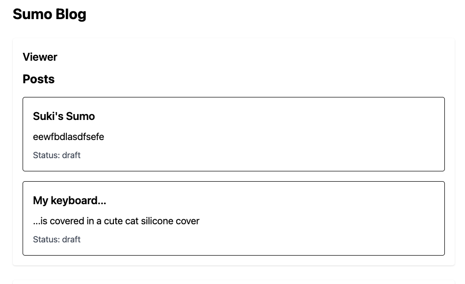
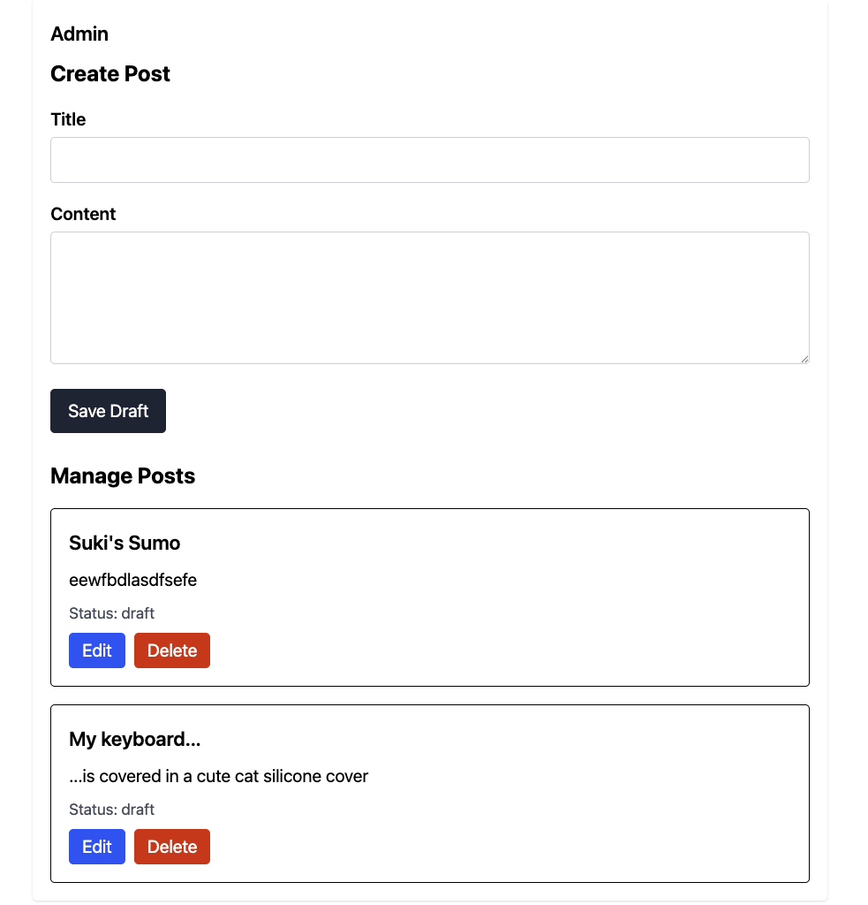

# Sumo Blog

A full-stack blog application themed around sumo wrestling. Built to demonstrate core CRUD functionality using React, Express, Node, and PostgreSQL.

---

## Overview

This project is a simple blog app with two areas:

- **Viewer**: read-only post display
- **Admin**: create and manage posts

It is meant to show the basic full-stack flow:

frontend → backend → database → backend → frontend

---

## Tech Stack

### Frontend

- React
- Vite
- Tailwind CSS

### Backend

- Node.js
- Express

### Database

- PostgreSQL

---

## Current Features

- Create posts
- View posts
- Delete posts
- Viewer/Admin separation
- Update functionality in progress or implemented depending on current branch state

---

## Project Structure

```text
project-root/
│
├── client/
│   ├── src/
│   │   ├── api/
│   │   ├── components/
│   │   ├── App.jsx
│   │   └── main.jsx
│
├── server/
│   ├── src/
│   │   ├── routes/
│   │   ├── db.js
│   │   └── index.js
│   ├── sql/
│   │   ├── schema.sql
│   │   ├── seed.sql
│   │
└── README.md
```

---

## Setup Instructions

### 1. Clone the repository

```bash
git clone https://github.com/itspaigenli/techtonica-projects.git
cd blog-app
```

### 2. Install dependencies

#### Server

```bash
cd server
npm install
```

#### Client

```bash
cd ../client
npm install
```

### 3. Create the PostgreSQL database

From the project root, create the database:

```bash
createdb blog_app
```

### 4. Run the schema and seed files

From the project root:

```bash
psql -d blog_app -f schema.sql
psql -d blog_app -f seed.sql
```

### 5. Add environment variables

Create a `.env` file inside the `server` folder:

```env
PORT=3000
DATABASE_URL=postgres://localhost:5432/blog_app
CLIENT_ORIGIN=http://localhost:5173
```

### 6. Start the backend server

```bash
cd server
npm run dev
```

### 7. Start the frontend client

Open a second terminal:

```bash
cd client
npm run dev
```

### 8. Open the app

Visit:

```text
http://localhost:5173
```

---

## How the App Works

1. A post is created in the Admin section
2. The frontend sends the request to the backend
3. The backend saves the post to PostgreSQL
4. The frontend fetches posts again
5. The UI updates with the latest data

---

## Screenshots

### Viewer

<!-- Add screenshot here -->



### Admin

<!-- Add screenshot here -->



---

## Notes

- `publish_date` is only set when a post is published
- Draft/publish behavior is being built incrementally
- Styling is currently minimal so the focus stays on functionality

---

## Future Improvements

- Publish button
- Draft vs published filtering
- Category filtering
- Feature images
- Authentication
- Improved UI styling

---

## Author

Paige
