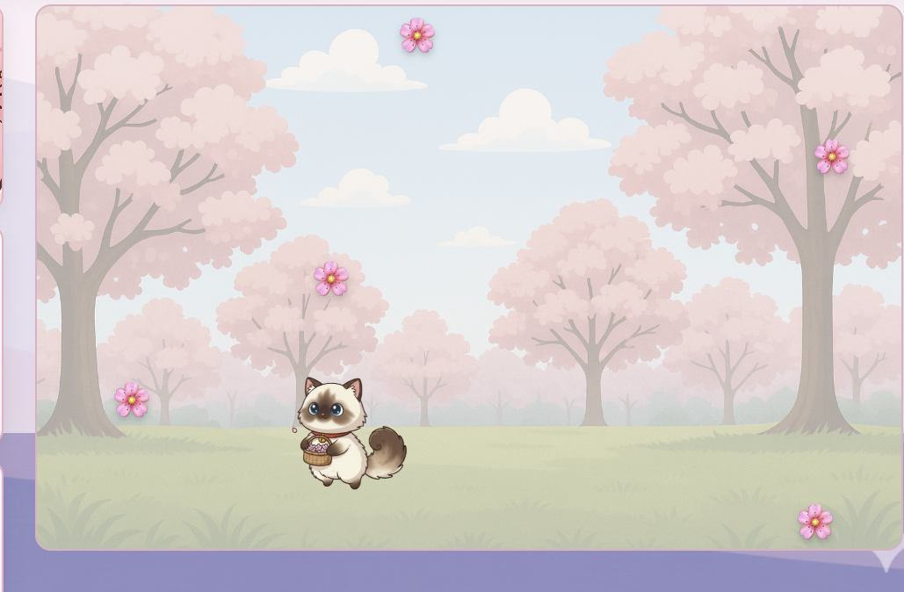
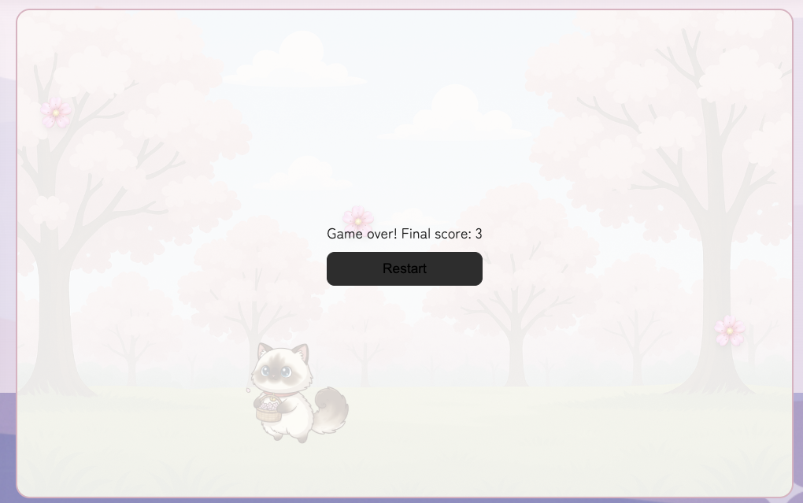
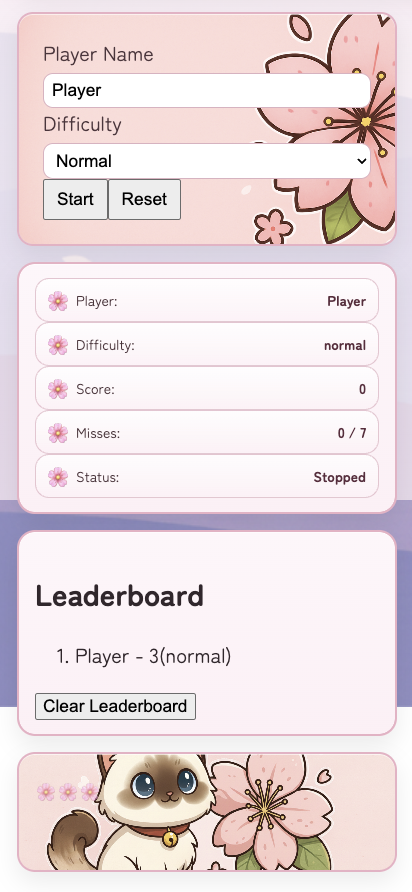

# 🌸 Suki’s Sakura Catch

A React-based game where you control Suki the cat and catch falling cherry blossom petals.

This project focuses on building interactive UI, managing game state, and structuring a React application in a clear and maintainable way.

---

## 🎮 How to Play

- Use **Left / Right arrow keys** to move Suki
- Catch falling blossoms 🌸 to increase your score
- Missing blossoms increases your miss count
- The game ends when you reach the maximum number of misses

---

## 📸 Screenshots

> Replace the image paths below with your actual screenshots.

### Game Start Screen

```md

```

### Gameplay

```md

```

### Game Over

```md

```

### Leaderboard

```md

```

---

## ⚙️ Features

### Core Gameplay

- Real-time falling objects (blossoms)
- Collision detection (catch vs miss)
- Score tracking
- Miss tracking with game-over condition
- Difficulty levels:
  - Easy
  - Normal
  - Hard

### Controls

- Start / Pause / Resume / Reset game
- Player name input
- Difficulty selection (locked during gameplay)

### Leaderboard (Persistent)

- Saves top scores using `localStorage`
- Tracks:
  - Player name
  - Score
  - Difficulty

- Automatically sorts highest → lowest
- Keeps top 5 scores
- Persists after page refresh
- Clear leaderboard button

---

## 🧠 Project Structure

```txt
src/
  components/
    Arena.jsx        # Game visuals (blossoms, catcher, overlay)
    Blossom.jsx      # Single blossom visual
    Controls.jsx     # Inputs + buttons
    Game.jsx         # Main game logic and state
    Leaderboard.jsx  # Score history display
    ScoreBoard.jsx   # Current game stats

  App.jsx
  App.css
  main.jsx
```

---

## 🏗️ Architecture Overview

This project separates logic from UI:

- **Game.jsx (logic layer)**
  Handles:
  - state management (score, misses, blossoms)
  - game loop (spawn, movement, collision)
  - keyboard input
  - leaderboard persistence

- **Arena.jsx (presentation layer)**
  Handles:
  - rendering blossoms
  - rendering the catcher (Suki)
  - overlay (start / pause / game over)

- **UI Components**
  - Controls → user input
  - ScoreBoard → live stats
  - Leaderboard → saved scores

---

## 💾 Data Persistence

Leaderboard data is stored in the browser using:

```js
localStorage;
```

Scores are:

- saved at game over
- sorted and trimmed to top 5
- reloaded on page refresh

---

## 🧪 What This Project Demonstrates

- React state management with `useState`
- Side effects with `useEffect`
- Handling real-time updates with intervals
- Keyboard event handling
- Conditional rendering
- Component-based architecture
- Browser storage (`localStorage`)

---

## 🚀 Future Improvements

- Highlight new high score
- Add sound effects
- Animate blossoms with CSS or canvas
- Add mobile/touch controls
- Store leaderboard on a backend

---

## 📌 Notes

This project was refactored to improve:

- separation of concerns (logic vs UI)
- readability and maintainability
- alignment with beginner-friendly React patterns

---

## ▶️ Run the Project

```bash
npm install
npm run dev
```

Open the provided localhost URL in your browser.
